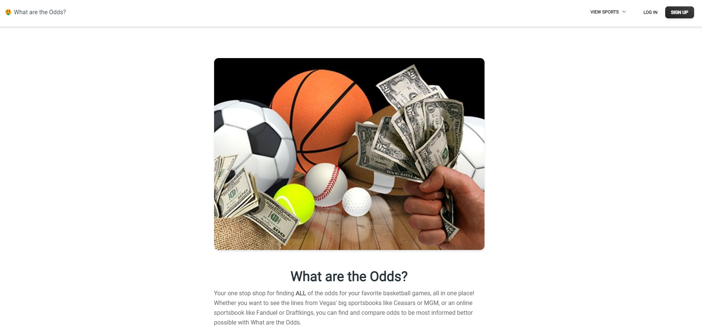
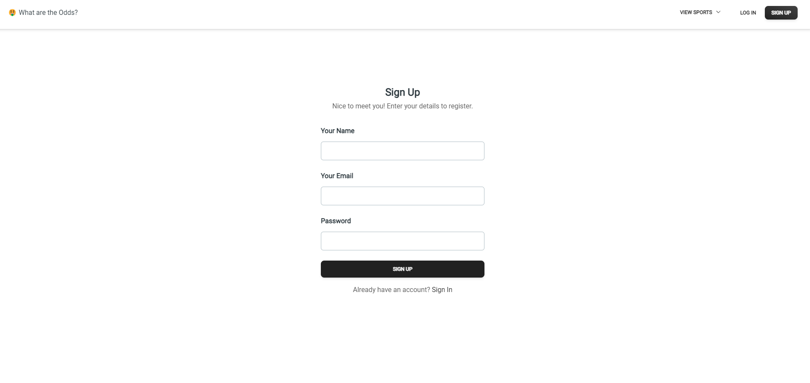
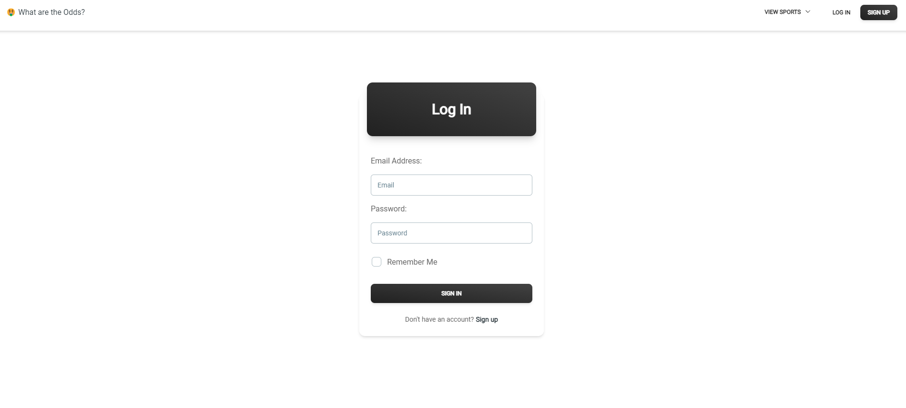

# WHAT ARE THE ODDS


## Table of Contents

- [Description](#Description)
- [Installation](#Installation)
- [Local Usage](#Local-Usage)
- [Links](#Links)
- [Questions](#Questions)
- [License](#License)
- [Screenshots](#Screenshots)

##

## Description

Your one stop shop for finding ALL of the odds for your favorite basketball games, all in one place! Whether you want to see the lines from Vegas' big sportsbooks like Ceasars or MGM, or an online sportsbook like Fanduel or Draftkings, you can find and compare odds to be most informed bettor possible with What are the Odds.

## Deployed Site Link

https://what-are-the-odds-xv5j.onrender.com/

## Installation

1. To install application, clone the main project via the HTTP or SSH link on github.

```
git clone https://github.com/markcurtiss720/What-are-the-Odds.git
```

2. Once cloned, open the project folder in your text editor and run the following command in terminal to install all dependencies.
   Important note - You will need to run the below command in the 'root', 'client' and 'server' directory paths.

```
npm install
```

## Local-Usage

To view the application in your local browser, cd into the root directory path and run this in terminal:

```
npm run seed

npm run develop
```

## Links

(-----Render Link-----)

## Built With

- React
- Apollo Client
- GraphQL
- Json web token
- Jwt-decode
- MongoDB
- Mongoose
- Express
- Node.js
- Bcrypt
- localStorage
- JSX / JavaScript
- HTML
- CSS

## Questions

- [Mark Curtis](https://github.com/markcurtiss720)
- [Tomas Vargas](https://github.com/tavargas9)
- [Collin Pulsipher](https://github.com/cpulsipher24)
- [Aidan Lewis](https://github.com/AidanLewis203)
- [Andres Mejia](https://github.com/andedu15)


## License

[](https://opensource.org/licenses/MIT) This project is covered under the MIT License.

## Screenshots

- Home




- Sign Up




- Log In

